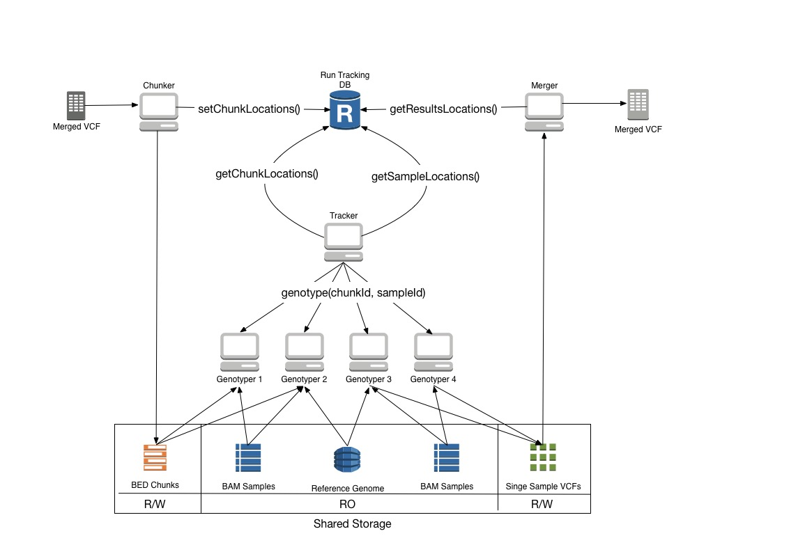

#Solution Architecture


# Getting Started
- Clone the repo
- Install gradle or run ./gradlew from any submodule
- Run ```gradle eclipse``` to generate eclipse project files
- Import project files into Eclipse


# Ports Configuration
The following ports need to be open for various components to work properly
- Salstack - TCP ports 4505-4506 on the Salt Master
- Consul - TCP ports only - 8300, 8400, 8500. TCP and UDP - 8301, 8302, 8600
- Influxdb - TCP port 8083, 8086
- Collectd - UDP port 25826
- Grafana - HTTP port 3000


# Cluster Provisioning
VMs are launched using a tool called [Terraform](https://github.com/hashicorp/terraform). Terraform supports many cloud platforms. This project currently only has configuration for Openstack based VMs. Configurations for launching different machine types are located in the [bootstrap module](bootstrap/provision/terraform/). 

### Salt Master IP
Because VMs are orchestrated by [Saltstack](https://github.com/saltstack/salt) post-launch, the IP Address of a Salt Master needs to be injected at VM launch time, thus all Terraform commands in this project expect a variable named `salt_master_ip` to be defined. The easiest wasy to set this variable is by exporting an environment variable 

```export TF_VAR_salt_master_ip=123.123.123.123```

wherever Terraform commands will be executed.

### Cloud Credentials
Interacting with a cloud environment requires a set of credentials. For Openstack these are provided to Terraform in the form of a `my_credentials.tfvars` file. This file needs to define the following properties:

```
user_name = "my_username"
password = "my_password"
auth_url = "path_to_openstack_auth_api"
key_file = "path_to_key_file_for hosts"
bastion_key_file = "path_to_key_file_for_bastion"
bastion_host = "ip_of_bastion"
```

This configuration assumes that access to the cloud is facilitated via a bastion host. The bastion host needs to have an IP and SSH key defined. Furthermore, an SSH key for accessing VMs behind the bastion is also required.

### Launch VMs
Navigate to the directory that contains the definition of the VMs you want to launch. Then run:

```terraform apply -var-file ../my_credentials.tfvars```

Terraform will create a file called `terraform.tfstate` that describes the state of the infrastructure that has been launched. Notably, success or failure of launching various artefacts will be recorded here. If not all of the infrastructure is launched successfully, you can resolve the intervening issues and `apply` again - infrastructure will then be incrementally rebuilt i.e. only those machines that failed to stand up on the earlier try will be affected.

### Destroy VMs

```terraform destroy -var-file ../my_credentials.tfvars```

N.B. Make sure to remove the destroyed VM's public key from the Salt Master to allow the VM to reconnect to the master when it is recreated again. You can use a command like

```salt-key -d vm-name-prefix-*```

on the Salt Master.

# Cluster Configuration

A cluster is composed of a number of VMs, each of which fulfills a partiular functional role: genotyper, tracker, merger, chunker, monitoring-server, etc. Configuration of these VMs is facilitated via [Saltstack](https://github.com/saltstack/salt). Saltstack uses a client-server model where a Salt Master machine can manage the configuration of a large fleet of Minion VMs. Thus, *the first order of business when building out a cluster is to establish a Salt Master*.

## Salt Master
The Salt Master machine facilitates coordination of configuration tasks that manage a computational cluster on the cloud.

### Provisioning
* On the machine you're launching your infrastructure from navigate to `bootstrap/provision/terraform/salt-master`
* Run ```terraform apply -var-file ../my_credentials.tfvars```
* When the VM launches SSH onto it
 
### Salt setup
The project code should already be checked out for you by the provisioning script in 

``` /home/centos/germline-regenotyper ```

The root of the Saltstack environment is at `/srv/`. Salt states are at `/srv/salt/` and pillars are at `/srv/pillar`. Symlinks are automatically set up for you by the provisioning script.

```
ln -s /home/centos/germline-regenotyper/bootstrap/conf/salt/state /srv/salt
ln -s /home/centos/germline-regenotyper/bootstrap/conf/salt/pillar /srv/pillar
```

### Fininishing Salt Master Configuration
Now that Salt is set up you can run

```salt salt-master state.highstate```

to finish configuring the Salt Master machine. If everything worked well you should see an output similar to this:

```
salt-master:
  Name: unzip - Function: pkg.installed - Result: Clean
  Name: /opt/consul/agent - Function: archive.extracted - Result: Clean
  Name: /opt/consul/ui - Function: archive.extracted - Result: Clean
  Name: /opt/consul/agent/consul - Function: file.managed - Result: Clean
  Name: /usr/bin/consul - Function: file.symlink - Result: Clean
  Name: /var/consul - Function: file.directory - Result: Clean
  Name: /etc/opt/consul.d - Function: file.directory - Result: Clean
  Name: /etc/opt/consul.d/ - Function: file.recurse - Result: Clean
  Name: dnsmasq - Function: pkg.installed - Result: Clean
  Name: /etc/dnsmasq.conf - Function: file.managed - Result: Clean
  Name: /etc/dnsmasq.d/10-consul - Function: file.append - Result: Clean
  Name: /etc/dnsmasq.d/10-proxy - Function: file.append - Result: Clean
  Name: dnsmasq - Function: service.running - Result: Clean
  Name: collectd - Function: pkg.installed - Result: Clean
  Name: collectd-postgresql.x86_64 - Function: pkg.installed - Result: Clean
  Name: collectd-java.x86_64 - Function: pkg.installed - Result: Clean
  Name: collectd-generic-jmx.x86_64 - Function: pkg.installed - Result: Clean
  Name: collectd-write_sensu.x86_64 - Function: pkg.installed - Result: Clean
 
``` 

## Configuration via roles
All Saltstack based configuration mapping in the cluster is accomplished via roles. Each machine in the cluster is assigned one or more Salt roles via the Saltstack grains mechanism. These are populated at VM launch through the Terraform configuration files

[saltmaster.tf](bootstrap/conf/provision/terraform/salt-master/saltmaster.tf)
```
"echo 'roles: [salt-master, consul-bootstrap, monitoring-server]' | sudo tee -a /etc/salt/grains"
```

This gives the Salt Master VM `salt-master`, `consul-bootstrap`, and `monitoring-server` roles. The `top.sls` file then maps roles to states using the [grain targeting method](https://docs.saltstack.com/en/develop/topics/targeting/index.html). When `state.highstate` command is run all of the states matching the roles that minion has are applied. 

[top.sls](bootstrap/conf/salt/state/top.sls)

```
base:
  '*':
    - consul
    - dnsmasq
    - collectd
#    - hostfile
  'G@roles:consul-bootstrap':
    - consul.bootstrap
  'G@roles:consul-server':
    - consul.server
  'G@roles:consul-client':
    - consul.client
  'G@roles:monitoring-server':
    - influxdb
    - grafana 
  'G@roles:genotyper':
    - dnsmasq.gnos
    - biotools.freebayes
  'G@roles:tracker':
    - airflow
    - postgres
    - run-tracking-db
  'G@roles:glusterfs-server':
    - gluster
    - gluster.bricks
  'G@roles:glusterfs-master':
    - gluster
```

## Monitoring
This project uses [Collectd](https://github.com/collectd/collectd) for collecting metrics, the metrics are then shipped to an [InfluxDB](https://github.com/influxdb/influxdb) time series database, and are visualized using [Grafana](https://github.com/grafana/grafana) real-time dashboards.

### Monitoring Server
The `monitoring-server` role currently deploys an InfluxDB instance and Grafana onto a host. This role is at present assigned to the Salt Master.

### Monitoring Clients
Metrics collection is facilitated by assigning the `collectd` state to all VMs in the cluster via the `top.sls` file. Configuration of various Collectd plugins is contained in the [collectd.conf](bootstrap/conf/salt/state/collectd/collectd.conf) file. All vital host metrics are collected:

* Load (Blended score)
* CPU
* RAM
* Disk I/O
* Disk Space
* Network I/O
* Database Metrics
* Process-specific metrics

### Influx DB
The Influx DB admin UI is published on http://localhost:8083 of the Monitoring Server. Currently only the local interface is listened to.

### Grafana
The Grafana dashboard website is published on http://localhost:3000 of the Monitoring Server. Currently only the local interface is listened to.
