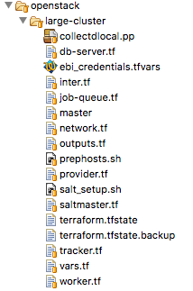
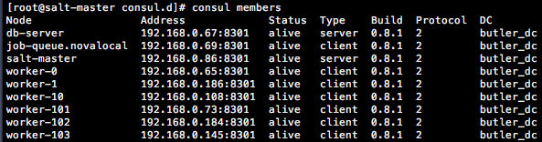

.. highlight:: rst

.. role:: python(code)
    :language: python

.. role:: shell(code)
    :language: shell

.. role:: sql(code)
    :language: sql


==================
Installation Guide
==================

Butler installation proceeds through a series of stages each of which is described below and further expanded
in the :doc:`Reference Guide<reference>`. They are:

* :ref:`Cluster Provisioning/Deployment<cluster_deployment_section>`
* :ref:`Software Configuration<software_configuration_section>`
* :ref:`Workflow/Analysis Configuration<workflow_configuration_section>`
* :ref:`Workflow Test Execution<test_execution_section>`

It is important to distinguish between test and production deployments of Butler. The key distinction between
these is that a test deployment is typically on a small scale and involves a minimum number of configurations
that can be performed directly in a fork of the Butler repository. A production deployment is not only on a
larger scale but also typically involves the creation of an additional git repository that holds the necessary
configurations, customizations, workflows, analyses, and scripts that arise from production usage of the system.
The scope of this guide covers a test deployment scenario, while the :doc:`Reference Guide<reference>` contains
additional information useful for production scenarios.

The Butler git repository contains a folder called *examples* which houses the files necessary to perform test
deployments of the system to a variety of cloud computing environments (Openstack, AWS, Azure), as well as some
example workflows, analysis configurations, test data, and useful scripts. Adopting these to your own needs is
often the easiest way to move forward.

.. _cluster_deployment_section:

Cluster Provisioning/Deployment
-------------------------------

Provisioning of a Butler cluster is accomplished using the Terraform open-source library which contains modules
that translate Terraform-formatted configuration files into native API calls for over 15 different cloud providers.
Butler ships with example configurations for the most popular cloud providers (Openstack, AWS, Azure) that you can
use to easily deploy to these clouds. This section outlines the general steps of Terraform-based Butler deployments
while cloud-specific deployment topics are covered in corresponding sub-sections.

To start your Butler deployment you need 3 things:

* An account on a supported cloud provider with API access to create Virtual Machines (login credentials, API URL).
* Installation of Terraform CLI on a machine that can communicate over the network with your cloud API of choice.
* A set of Terraform configuration scripts that define your deployment specifics (e.g. https://github.com/llevar/butler/tree/master/examples/deployment)

To deploy to any cloud you will need a set of credentials. These are typically some subset of username/password,
API key, API URL. You will also want to have an SSH keypair ready. Your public key will be put on the VMs you
create so that you can actually SSH onto them.

Butler deployments can be triggered from any machine that has API access to the target cloud. This is typically
your local machine or a designated VM on the same cloud. You can get the latest Terraform CLI from their download
page - https://www.terraform.io/downloads.html.

At this point you should clone the Butler git repo to the machine you are deploying Butler from.

.. code-block:: shell

	git clone https://github.com/llevar/butler

Navigate to the examples/deployment subdirectory to see configuration files relevant to your cloud providers of
choice.

.. _openstack_terraform_files:


   Typical Terraform configuration files for a Butler deployment.

:numref:`openstack_terraform_files` shows the typical layout for a Butler deployment directory. Each file ending in
:shell:`.tf` is a Terraform configuration file that is responsible for some aspect of the deployment. Other auxiliary
files are used to provide initial configurations for the VMs as they are created.

Using Terraform you are going to set up networking for your deployment (:shell:`network.tf`), set up security groups
(:shell:`security.tf`), and launch various VMs (:shell:`saltmaster.tf, worker.tf` etc.).

It is possible to deploy Butler in many different ways depending on the scale of analysis that is being performed. In
the examples each major component is deployed onto its own VM except for the Monitoring Server which is co-located with
the Configuration Server. These components are as follows:

* :shell:`saltmaster.tf` - The saltmaster is a VM that plays a dual role. It is a Configuration Server - a machine that
  is responsible for managing the configuration state of all VMs in a Butler cluster. It is a Monitoring Server - a
  machine that all the other VMs send their health metrics and logs to. This dual role is possible because configuration
  mostly happens when the cluster is first launched, and only sporadically after, when new machines are added, otherwise
  the machine's resources are free for other uses such as monitoring.
* :shell:`tracker.tf` - The tracker is a VM that hosts various workflow engine components including the workflow scheduler
  and the tracker Python module and CLI, which is the main interface to Butler.
* :shell:`job-queue.tf` - The job-queue VM runs a RabbitMQ distributed queue that holds various tasks that have been
  scheduled for execution by the workflow scheduler.
* :shell:`db-server.tf` - The db-server VM is a database server that runs PostgreSQL Server with a number of databases that
  are used by Butler, including the run-tracking-db which keeps track of workflows, analyses, and their execution state.
* :shell:`worker.tf` - The workers are VMs that do the actual computational work specified in workflow definitions. These
  machines talk to the job queue and pick up executable tasks when they are free. They periodically report status back to
  the tracker.

Each Terraform configuration file that defines VMs has a similar structure. A VM needs to have a name, flavour, base image,
network, security groups, and SSH connection info. See :numref:`aws_terraform_basic_params`

.. _aws_terraform_basic_params:
.. code-block:: shell
	:caption: Basic VM parameters (AWS)

	ami = "${lookup(var.aws_amis, var.region)}"
	instance_type = "t2.micro"
	associate_public_ip_address = true
	tags {
		Name = "salt-master"
	}

	vpc_security_group_ids = ["${aws_security_group.butler_internal.id}"]
	subnet_id = "${aws_subnet.butler.id}"

	key_name = "${aws_key_pair.butler_auth.id}"

	connection {
	  type     = "ssh"
	  user     = "${var.username}"
	  private_key = "${file(var.private_key_path)}"
	  bastion_private_key = "${file(var.private_key_path)}"
	  bastion_host = "${aws_instance.butler_jump.public_ip}"
	  bastion_user = "${var.username}"
	  host = "${aws_instance.salt_master.private_ip}"
	}

Once the VM is launched and reachable via SSH Terraform will use a number of :shell:`provisioners` to upload any necessary setup
files or execute the first set of commands. See :numref:`aws_terraform_provisioners`

.. _aws_terraform_provisioners:
.. code-block:: shell
	:caption: VM provisioners

	provisioner "file" {
	  source = "../../../../provision/base-image/install-packages.sh"
	  destination = "/tmp/install-packages.sh"
	}
	provisioner "remote-exec" {
	  inline = [
	    "chmod +x /tmp/install-packages.sh",
	    "/tmp/install-packages.sh"
	  ]
	}

Terraform has a concept of variables and most of the settings you will want to configure from deployment to deployment are
parametrized and extracted into a single file called :shell:`vars.tf`. When you populate variable values in this file they
will be substituted into various other configurations as necessary. From time to time you may want to change a value that
is not exposed through :shell:`vars.tf` you will then need to edit one of the configuration files directly.

The Terraform CLI has a few commands that are well documented on their website (https://www.terraform.io/docs/index.html).
The most useful ones for Butler are:

* :shell:`terraform plan` - Display the sequence of commands that Terraform will run based on the supplied configurations.
* :shell:`terraform apply` - Execute the actual configurations defined in your :shell:`.tf` files launching VMs as needed.
* :shell:`terraform destroy` - Destroy all of the objects specified in the :shell:`.tf` files.

When you run :shell:`terraform apply` Terraform creates a tree structure of the intended infrastructure and its status and
stores it in a file called :shell:`terraform.tfstate`. If not all of the infrastructure is successfully created when you run
:shell:`terraform apply` then :shell:`terraform.tfstate` will reflect that. You can make necessary changes and safely run
:shell:`terraform apply` again and things will pick up where they were left off. If you damage or destroy your :shell:`terraform.tfstate`
file the next time you run :shell:`terraform apply` all of your infrastructure will be created from scratch. It can be a good
idea to check this file into source control after making sure it does not contain any secrets you want to keep.

Now that you have some idea of what Terraform is doing to deploy Butler clusters you should follow one of the platform specific
deployment sections below to launch your first Butler cluster.

Deployment on OpenStack
```````````````````````

We will be using the Terraform configuration files found at examples/deployment/openstack/large-cluster to deploy our Butler
cluster on OpenStack. The necessary configuration values can be populated directly into the respective variables inside :shell:`vars.tf` file.
Alternatively you can create a separate file with the extension :shell:`.tfvars` which contains a list of key/value pairs
(:shell:`variable_name = variable_value`) that are used to assign values to these variables. Since this file is likely to contain
sensitive information it is a good idea to add it to your :shell:`.gitignore` so that you don't check it in by accident.
You can also supply variable values as environment variables with the form :shell:`TF_VAR_variable_name`.

Variables you need to set:

* :shell:`user_name` - Username for authentication with OpenStack API
* :shell:`password` - Password for authentication with OpenStack API
* :shell:`auth_url` - Openstack Auth URL (something like https://my_api_endpoints:13000/v2.0)
* :shell:`tenant_name` - Name of your tenant on OpenStack
* :shell:`main_network_id` - ID of the main network your hosts belong to (get this from OpenStack console).
  If you have multiple networks you will need to configure them inside the individual :shell:`.tf` files or
  parametrize them out to :shell:`vars.tf`.
* :shell:`key_pair` - Name of the keypair you have added to OpenStack. This public key will be put on the VMS you create
  so that you can SSH to them.
* :shell:`user` - Username that can be used to SSH to the VMs
* :shell:`key_file` - Path on the local machine to the private SSH key you will use to connect to your VMs
* :shell:`bastion_host` - IP of the bastion host (if you are using one, more on this below)
* :shell:`bastion_user` - Username that can be used to SSH to the bastion host (if you are using a bastion)
* :shell:`bastion_key_file` - Path to private key for login to the bastion host (if you are using a bastion)
* :shell:`image_id` - ID of the base VM image that you will use to launch VMs (get this from OpenStack console).
* :shell:`floatingip_pool` - Name of floating IP pool (if used)
* :shell:`worker_count` - Number of workers to launch. Set this to a small number (like 1) for your first couple
  of launches.
* :shell:`main-security-group-id` - ID of the default security group used by your hosts (get this from OpenStack console).

N.B. Although Butler is theoretically OS-agnostic, all of the deployments to date have used **CentOS** as the platform. If you want
Butler to work out of the box you should use CentOS as your base VM image. If you want to use another OS you should expect to
have to make some modifications to the YAML Saltstack state definitions that are responsible for software deployment and configuration.
Although these states are largely cross-platform about 10% have CentOS specific configurations that would need to be changed to
successfully deploy on another platform.


It is usually a good idea from a security standpoint to limit access to your VMs from the outside world. Thus, it is advisable
to set up a separate VM (the bastion host) which will be the only host on your cluster with a public IP and have all the other
hosts reside on a private subnet such that they can be tunneled into via the bastion host. You should further limit access by
restricting SSH access to the bastion to a whitelist of trusted IPs or subnets. To facilitate deployment in this scenario
populate the bastion variables that have been described above.

Each Butler VM that you deploy has a specific OpenStack VM flavor. If you have non-standard flavor names on your deployment or you wish to
use non-default values then you can populate the following variables:

* :shell:`salt-master-flavor`
* :shell:`worker-flavor`
* :shell:`db-server-flavor`
* :shell:`job-queue-flavor`
* :shell:`tracker-flavor`

Once you have populated these variables with values you are ready for deployment. Run :shell:`terraform plan -var-file path_to_your_vars_file.tfvars`
to see what actions Terraform is planning to take based on your configurations. If you are satisfied then you are ready to run
:shell:`terraform apply -var-file path_to_your_vars_file.tfvars`. This will launch your Butler cluster into existence over the course
of about 10-20 minutes depending on size. If all is well you will see a message at the end that your resources have been successfully created.
You are now ready to move on to the Software Configuration stage of the deployment.

When you are done with your cluster you can cleanly tear it down by running :shell:`terraform destroy -var-file path_to_your_vars_file.tfvars`

Troubleshooting OpenStack Deployments
'''''''''''''''''''''''''''''''''''''

Terraform is pretty good about printing out information about error conditions that occur, thus, if you find yourself with repeated failures
to deploy you should closely examine the program output to see if it contains the information for pinpointing the cause of the failure. Most often
the errors revolve around misspellings of usernames, flavors, API endpoints and so on, or inappropriate SSH credentials. If you are not finding
the default information provided to be sufficient you can enable debug output by setting the :shell:`TF_LOG=DEBUG` environment variable where you
run terraform from. This will produce a lot of output but it can help figure out what the issue is. Additionally, because Terraform makes OpenStack
API requests on your behalf, the errors it encounters are not always adequately represented in the output. You can enable OpenStack specific debug
output by setting the :shell:`OS_DEBUG=1` environment variable which will allow you to inspect the individual OpenStack API calls that are being made
and the responses that are being received. Once you are done debugging it is highly recommended to unset these variables.

Deployment on AWS
```````````````````````

We will be using the Terraform configuration files found at examples/deployment/aws/large-cluster to deploy our Butler
cluster on Amazon Web Services. The necessary configuration values can be populated directly into the respective variables
inside :shell:`vars.tf` file. Alternatively you can create a separate file with the extension :shell:`.tfvars` which contains a
list of key/value pairs (:shell:`variable_name = variable_value`) that are used to assign values to these variables. Since this
file is likely to contain sensitive information it is a good idea to add it to your :shell:`.gitignore` so that you don't check
it in by accident. You can also supply variable values as environment variables with the form :shell:`TF_VAR_variable_name`.

Variables you need to set:

* :shell:`access_key` - AWS Access Key.
* :shell:`secret_key` - AWS Secret Key.
* :shell:`region` - Name of the region you are deploying to.
* :shell:`username` - Username that can be used to SSH to the VMs.
* :shell:`private_key_path` - Path on the local machine to the private SSH key you will use to connect to your VMs.
* :shell:`private_key_path` - Path on the local machine to the public SSH key that will be put on your VMs.
* :shell:`aws_amis` - A list of AMI IDs for each region that you want to deploy to.
* :shell:`worker_count` - Number of workers to launch. Set this to a small number (like 1) for your first couple
  of launches.


N.B. Although Butler is theoretically OS-agnostic, all of the deployments to date have used **CentOS** as the platform. If you want
Butler to work out of the box you should use CentOS as your base VM image. If you want to use another OS you should expect to
have to make some modifications to the YAML Saltstack state definitions that are responsible for software deployment and configuration.
Although these states are largely cross-platform about 10% have CentOS specific configurations that would need to be changed to
successfully deploy on another platform.

Each Butler VM that you deploy has a specific AWS VM flavor. If you have non-standard flavor names on your deployment or you wish to
use non-default values then you can populate the following variables:

* :shell:`salt-master-flavor`
* :shell:`worker-flavor`
* :shell:`db-server-flavor`
* :shell:`job-queue-flavor`
* :shell:`tracker-flavor`

Once you have populated these variables with values you are ready for deployment. Run :shell:`terraform plan -var-file path_to_your_vars_file.tfvars`
to see what actions Terraform is planning to take based on your configurations. If you are satisfied then you are ready to run
:shell:`terraform apply -var-file path_to_your_vars_file.tfvars`. This will launch your Butler cluster into existence over the course
of about 10-20 minutes depending on size. If all is well you will see a message at the end that your resources have been successfully created.
You will also see a list of VM names and their IP Addresses.

The Terraform deployment process creates a separate VM that will be used as a gateway host to all of the other VMs in the Butler deployment.
Access to these VMs is disabled from the outside (via security group) and is only available from the gateway host that is called butler_jump.
Your private key is pre-populated onto this host by the deployment process. Additionally IPs of the Butler management nodes are mapped to
friendly names via the /etc/hosts file on butler_jump. Thus, to log onto the salt-master for instance, ssh onto the butler_jump host and from
there SSH onto salt-master simply by running :shell:`ssh salt-master`. The worker nodes are not mapped by name and you should connect to them
using their private IP addresses if you need to.

You are now ready to move on to the Software Configuration stage of the deployment.

When you are done with your cluster you can cleanly tear it down by running :shell:`terraform destroy -var-file path_to_your_vars_file.tfvars`.
Make sure to check for any orphaned volumes that may not have been destroyed by the process.


Deployment on Microsoft Azure
```````````````````````

This section is under construction, please check back soon.


.. _software_configuration_section:

Software Configuration
----------------------

The software configuration requirements of Butler are fulfilled by the Saltstack (https://saltstack.com/) open source framework. Saltstack allows
us to define a series of *states* which are YAML-formatted recipes for installing and configuring software. Sets of states can be mapped to a *role*
which describes some useful function performed in a software system. Finally, roles can be assigned to individual VMs that will play those roles
in a deployment. A centralized configuration server, the *salt-master*, keeps a record of all of the states and role assignments and communicates
with all of the machines in the cluster to set up and configure software on them that is appropriate to their role. Detailed documentation on the
myriad features that Saltstack has can be found on their website (https://docs.saltstack.com/en/latest/). Butler-focused documentation is found in the
:ref:`Configuration Management<cluster_configuration_management_section>` section of the Reference Guide.

In Butler we use Saltstack not only to configure components of Butler itself but also to deploy and configure software that is used by the actual
workflow steps. All of the Butler-specific configurations are located in the *configuration/salt* folder of the source tree.

Each VM has what in Saltstack parlance is called a *highstate* that is the state where all of the software configurations that have been prescribed
have been successfully applied. In order to fully configure our system then we need to apply this *highstate* to all of our VMs. This can be done
by manually running the necessary commands or by executing the Salt orchestrator that we have developed for this purpose.

At this point you need to SSH to the salt-master and change the user to root. Then issue the following commands at the shell:

.. code-block:: shell

	salt-run mine.update '*'
	salt-run state.orchestrate butler.deploy


It can take up to 30 minutes for all of the necessary software to be installed. The results will be periodically dumped to standard out and standard error.
These are typically color-coded where green means that everything went well and red means that there were some errors. If everything is well you
should have a working Butler cluster on your hands at this point. You can run a few salt commands from the salt-master to make sure that the individual
components are up and working. Since your deployment can have hundreds of VMs Saltstack makes it very easy to interrogate them en-masse.

N.B. Because the Salt setup can take a good long while it is recommended to run your commands inside a *screen* or *tmux* session to prevent network
disconnects from interrupting the setup.

.. _service_discovery_validation_section:

**Service Discovery Validation and Troubleshooting**

One of the key components that is required for Butler to work properly is Service Discovery i.e. various VMs need to know how to find each other on the
network by service name rather than IP address. For this purpose we use a tool called Consul (https://www.consul.io/). All of the VMs participate in a
Consul cluster and use it to discover the services, such as databases and queues, that are available. To see if Consul is properly set up you can run

.. code-block:: shell

	consul members

at the shell of any VM. You should see an output similar to :numref:`consul_members`. All of the VMs that you deployed should be on this list with
status *alive*.

.. _consul_members:


   Output of consul members command.

If all of the VMs are present in the list you can test that the service name to IP address translation works by running

.. code-block:: shell

	ping postgresql.service.consul
	ping rabbitmq.service.consul
	ping influxdb.service.consul

Each of these should come back with an IP address of some VM on your cluster. If this works, Consul should be working properly at this point and you
can skip to the :ref:`next section<database_server_validation_section>`.

If you do not see all of the machines in your cluster listed under :shell:`consul members` or the names of services are not being resolved properly
you will need to troubleshoot Consul. Several things could be interfering with proper Consul operation:

* The Consul service may not be running on all VMs.
* Some VMs may not have been able to join, or dropped out of the Consul cluster.
* Networking issues may prevent inter-VM communication.

To see if the Consul service is operating properly you can check its status on all VMs. There are two brands of this service :shell:`consul-server`
and :shell:`consul-client` that are assigned to various VMs via Saltstack roles (check an individual VM's roles by looking at /etc/salt/grains). There
should be at least two servers in a cluster for Consul to operate properly. Check the status of all services by running the following commands at the
shell of the salt-master:

.. code-block:: shell

	 salt -G 'roles:consul-server' cmd.run 'service consul-server status'
	 salt -G 'roles:consul-client' cmd.run 'service consul-client status'

Investigate the output of these commands to see if all of the services are running without errors, resolve the errors and restart the services as
necessary.

If not all VMs are in the Consul cluster you can attempt to join them all to the cluster automatically by running the appropriate salt state

.. code-block:: shell

	 salt 'salt-master' state.apply consul.join-all

You can also join the cluster manually by logging on to any VM and running the following command at the shell:

.. code-block:: shell

	 consul join IP_ADDRESS

where IP_ADDRESS is the IP address of any machine that is already in the cluster.

Because of the breadth of possibilities of networking issues that can affect connectivity between VMs this guide cannot offer specific troubleshooting
steps except mentioning that an easy test of connectivity would be to try to ping different VMs by IP address to try to see if there is a response.

.. _database_server_validation_section:

**Database Server Validation and Troubleshooting**

The database server VM runs an instance of PostgreSQL server which operates a number of databases that are used by various Butler components. These are:

* **airflow** - used by the workflow engine
* **celery** - used by the task queue
* **run_tracking** - used by the Butler analysis tracker
* **grafana** - used by the monitoring dashboards

The first thing to do is to validate that the PostgreSQL service is actually running. You can do this by running the following command at the salt-master
shell:

.. code-block:: shell

	 salt 'db-server' cmd.run 'service postgresql-9.5 status'

If the service is not running you will need to log onto the db-server VM and troubleshoot the PostgreSQL installation. They have excellent and comprehensive
documentation (https://www.postgresql.org/docs/9.5/static/docguide.html).

Once you know that the service is running you should test whether another VM can connect to it for SQL queries. Run the following command at the salt master
shell:

.. code-block:: shell

 salt 'db-server' postgres.db_list host=postgresql.service.consul \
 port=5432 user=butler_admin password=butler maintenance_db=postgres

You should see a list of databases that includes all of the ones that were mentioned above (airflow, celery, grafana, run_tracking).
If you do not see these or are not able to connect to the server you will need to troubleshoot this connection issue.

One of the most common sources of connection issues is the permissions file :shell:`hba.conf`. This file is located at
:shell:`/var/lib/pgsql/9.5/data/pg_hba.conf` on the db-server VM. This file controls who can connect to the database server using
what methods. Consult the PostgreSQL documentation for allowable settings.

If your database setup was not working properly after fixing it you will want to make sure that Salt actually brings the db-server
into highstate. If you don't want re-run highstate on all of the VMs you can target the db-server individually by running:

.. code-block:: shell

	salt 'db-server' state.highstate


.. _job_queue_validation_section:

**Job Queue Validation and Troubleshooting**

The job-queue VM runs an instance of RabbitMQ() which is a distributed queue that is used to hold workflow tasks and hand
them out to individual workers. To make sure that the queue is operational run the following command from the salt master
shell:

.. code-block:: shell

	salt 'job-queue' cmd.run 'service rabbitmq-server status'

If the service is running, you can validate that the *butler* user and *butler_vhost* are present by running:

.. code-block:: shell

	salt 'job-queue' rabbitmq.list_users
	salt 'job-queue' rabbitmq.list_vhosts

RabbitMQ additionally has a web interface that is published on port 15672 that you can use to interrogate the state of the queue.

If you encounter issues please consult the RabbitMQ manual (https://www.rabbitmq.com/documentation.html).

.. _workflow_engine_validation_section:

**Workflow Engine Validation and Troubleshooting**

The workflow engine used in Butler is Apache Airflow (https://airflow.incubator.apache.org/).
The server components of Airflow run on the tracker VM and include the Airflow Scheduler, Airflow Web UI, and Airflow Flower
(wrapper around Celery Flower). The client component of Airflow is Airflow Worker which runs on every worker VM.

Validate the workflow engine by making sure that all of the relevant services are running properly:

.. code-block:: shell

	 salt -G 'roles:tracker' cmd.run 'service airflow-scheduler status'
	 salt -G 'roles:tracker' cmd.run 'service airflow-webserver status'
	 salt -G 'roles:tracker' cmd.run 'service airflow-flower status'
	 salt -G 'roles:worker' cmd.run 'service airflow-worker status'

When Airflow is first configured it creates some DB tables, make sure that these tables are present:

.. code-block:: shell

	salt 'db-server' postgres.psql_query \
	"SELECT tablename FROM pg_catalog.pg_tables WHERE schemaname = 'public'" \
	host=postgresql.service.consul port=5432 user=butler_admin \
	password=butler maintenance_db=airflow

Check if your workflows have been deployed properly by logging onto the tracker VM via SSH and running:

.. code-block: shell

	airflow listdags

Two web UIs that are helpful in managing the workflow engine are served up on the tracker VM the are -
the Airflow Web UI on port 8889 and the Celery Flower UI on port 5555. The Airflow Web UI in particular
is instrumental in keeping track of workflow progress and identifying issues with workflow execution.

.. _monitoring_validation_section:

**Monitoring Server Validation and Troubleshooting**

The monitoring components of Butler are optional to its core functionality but are highly useful for
identifying and troubleshooting operational issues. The monitoring components consist of a Monitoring
Server which runs a time-series database InfluxDB(https://www.influxdata.com/time-series-platform/influxdb/)
and a monitoring data visualization tool Grafana (https://grafana.com/). Monitoring clients (all VMs) run
a metrics collection daemon Collectd (https://collectd.org/) that collects health metrics and ships them
to the Monitoring Server.

Validate that these components are in order by making sure that the respective services are operating.

.. code-block:: shell

	 salt -G 'roles:monitoring-server' cmd.run 'service influxdb status'
	 salt -G 'roles:monitoring-server' cmd.run 'service grafana-server status'
	 salt '*' cmd.run 'service collectd status'

InfluxDB has an admin Web UI which is accessible on the Monitoring Server (salt-master VM by default) on
port 8083. Grafana is primarily accessed via its Web UI which presents the user with a series of dashboards
that visualize various metrics. Grafana is available on the Monitoring Server on port 3000. Validate that you
can access this URL and view various dashboards.

.. _saltstack_troubleshooting_section:

**General Saltstack Troubleshooting**

Butler is complex software that is distributed over many VMs and issues are sometimes inevitable. If you are
having difficulties getting the full software configuration to work it is advisable to proceed step-by-step
setting up individual machines in the order that they are specified in the *butler.deploy* orchestration state.
To this end you can commands like :shell:`salt salt-master state.highstate` and :shell:`salt job-queue state.highstate`
and observe whether they succeed or fail, resolving any issues. When you can get the individual steps to succeed you
can try executing all of the steps at once via the salt orchestrator.

Sometimes rather than running commands from the salt-master it is easier and more informative to run commands directly
from the VMs that you are trying to set up. For this purpose you can use the :shell:`salt-run` command which can be
used on any salt minion to target a particular state to that minion. The minion will communicate with the salt-master
retrieve latest state definitions and execute them locally. This command supports additional arguments to produce
debug output. You would thus run the following command on a VM you are trying to set up and are running into issues with:

.. code-block:: shell

	salt-call state.highstate -l debug

This will produce extensive debug output to standard out to help you identify configuration issues.

State definitions are taken by Salt directly from the Butler git repository (and are optionally overlayed with your own
custom states stored in a separate Git repo). If you are finding that your state changes are not being reflected in the
runtime environment you simply need to wait a little longer for the Salt cache to get refreshed. The git repo is polled
every 60 seconds for new state changes.

.. _workflow_configuration_section:

Workflow/Analysis Configuration
-------------------------------

Once all of the software components of Butler are installed and configured it is time to configure some test workflows
and analyses. Butler ships with several test workflows and analyses for you to try along with some data that is necessary
for testing. At this point most of our interactions will be with the Butler CLI which is accessible on the tracker VM so
you should SSH onto that host.

Butler keeps track of various workflows and analyses by keeping its own database on the db-server. To get started we need
to register some of our test workflows and create a test analysis. When we run Workflows for a particular Analysis on
data Butler also creates Analysis Runs. Each of these objects supports configuration parameters that are supplied in the form
of JSON files and are merged at runtime into an effective configuration which is a set of values that govern the execution
of a particular workflow instance where Workflow-level configuration is most general (it applies for all invocations of this
workflow), Analysis-level configuration overrides Workflow-level configuration (and applies for all Analysis Runs under one
Analysis), and Analysis Run-level configuration is the most specific (applies just for the one Analysis Run) and overrides the
previous two configuration levels. The JSON files that are supplied at each level are stored into Butler's database and can be
queried at any later date to reproduce the configuration settings for any particular execution. More details are available in
the Reference Guides :ref:`Analysis Tracker Section<analysis_tracker_section>`.

Airflow keeps its workflow definitions (called DAGS in Airflow parlance) in :shell:`/opt/airflow/dags` and we can register these workflows
with Butler by using Butler's :shell:`create-workflow` command as follows:

.. code-block:: shell

	butler create-workflow -n test -v 1.0 \
	-c /opt/butler/examples/workflows/test-workflow/test-workflow-config.json

Here the -n flag corresponds to the workflow name which should match the name of the Airflow DAG that will be executed by this
workflow. This name can be gleaned from the python file that defines the DAG structure, as below where the DAG name is *test*:

.. code-block:: python

	dag = DAG("test", default_args=default_args,
          schedule_interval=None, concurrency=10000, max_active_runs=2000)

N.B. If you do not use a matching name then Butler will not know which Airflow DAG to execute when you launch the workflow which will
result in runtime errors.

The -v parameter represents the workflow version, and the -c parameter a path to the JSON configuration file that supplies configuration
values that will apply to all invocations of this workflow.

When you run the :shell:`create-workflow` command you will be issued a numeric workflow_id corresponding to this workflow that you can
use to launch workflow instances. You can always look up a listing of existing workflow instances, along with their IDs by running
:shell:`butler list-workflows`.

Once you have a workflow registered it is time to create an Analysis.

.. code-block:: shell

	butler create-analysis -n test -d 01-01-2017 \
	-c /opt/butler/examples/analyses/test-analysis/analysis.json

The -n flag here corresponds to the analysis name, -d to the analysis date, and -c to the analysis-level JSON configuration file. The
analysis-level configuration augments and overrides workflow-level configuration, it will apply to all analysis runs that are executed
under this analysis. This command will generate an analysis ID. You can look up a listing of existing analyses and their IDs by running
:shell:`butler list-analyses`.

Once you have a workflow and an analysis created you can go on to the last stage of testing - creating and scheduling analysis runs.

.. _test_execution_section:

Workflow Test Execution
-----------------------

A workflow is launched in Butler using the :shell:`launch-workflow` command.

.. code-block:: shell

	butler launch-workflow -w 1 -a 1 \
	-c /opt/butler/examples/analyses/test-analysis/run-config/

Here -w corresponds to a workflow ID, -a corresponds to an analysis ID, and -c is a path to a directory that contains Analysis Run
configuration files. Each JSON file in this directory results in one Analysis Run being created. The typical use case is to use a
scripting language to generate these JSON files en masse, such that each file corresponds to an individual sample that needs to be
analysed and contains its ID and location. This isn't strictly necessary though, and depending on your workflow and needs each
analysis run configuration may even be an empty JSON file - :shell:`{}`. Running the launch-workflow command will send the
corresponding workflows off for scheduling by the Airflow engine and their status can be tracked on the Airflow Web UI.

.. _airflow_main_page:
.. figure:: images/airflow_web_ui_main_page.png

   The main page of Airflow Web UI.

The Airflow Web UI is published at http://airflow.service.consul:8889/airflow/. Once you have launched your workflow you can track
the status of execution on this UI, see :numref:`airflow_main_page`. If everything goes well you will see the workflow complete
with a green status. You can click on the "test" task to view the detail page which has a number of actions you can take, see
:numref:`airflow_task_detail`. Select "View Log" to validate that the task output is "Hello, world! - set by Analysis Run."

.. _airflow_task_detail:
.. figure:: images/airflow_task_actions.png

   The Airflow task actions.

This completes the installation and validation of Butler. As a next step you can experiment with other example workflows and
analyses that ship with Butler, or you can start running your own real payloads. Many more details about Butler internals are
in the :doc:`Reference Guide<reference>`.
