.. highlight:: rst

.. role:: python(code)
    :language: python
    
.. role:: shell(code)
    :language: shell
    
.. role:: sql(code)
    :language: sql


=======================
Reference Documentation
=======================

System Design
-------------

General Design Principles
`````````````````````````

To address the need for a large-scale cloud-based distributed workflow system that is suitable to scientific computing 
applications we present the design of our framework called Butler.

Although a detailed description of system Architecture and Design follows, we begin by describing several guiding 
principles that have been adopted in the design of this system:

* Existing Open-Source Software
* Service Orientation
* Cloud Agnosticity
* Open-Source License

Existing Open-Source Software
'''''''''''''''''''''''''''''

The scope of the requirements for a workflow system of the nature described in this work are quite vast and building 
such a system from scratch would take years of effort from an entire software team. On the other hand, many of the 
of the systems can be readily met via existing software products. Although commercial software products tend to have 
better technical support, in the interest of cost savings, and in order to keep the entire solution open source we 
have opted to use all Open Source Software components when building Butler.

Since keeping the amount of new code that needed to be written to build Butler to a minimum was one of the cornerstones 
of system design, a very substantial portion of the overall system 
consists of 3rd party OSS frameworks that are integrated together to produce Butler. These include:

.. csv-table:: Analysis DB table
	:header: "Product", "URL", "Role"

"Hashicorp Terraform", "https://github.com/hashicorp/terraform", "       Cluster Lifecycle Management"
"Hashicorp Consul", "https://github.com/hashicorp/consul", "          Service Discovery and Service Health Checking"
"Saltstack", "https://github.com/saltstack/salt", "            Cluster Configuration Management"
"Apache Airflow",  https://github.com/apache/incubator-airflow", "  Workflow Management"
"RabbitMQ", "https://github.com/rabbitmq/rabbitmq-server", "  Queuing"
"Celery", "https://github.com/celery/celery", "             Task Scheduling"
"Collectd", "https://github.com/collectd/collectd", "         Metrics Collection"
"InfluxData InfluxDB", "https://github.com/influxdata/influxdb", "       Metrics Storage"
"Grafana", "https://github.com/grafana/grafana/", "          Metrics Dashboards"
"Logstash", "https://github.com/elastic/logstash", "          Log Harvesting"
"Elasticsearch", "https://github.com/elastic/elasticsearch", "     Log Indexing and Aggregation"
"Kibana", "https://github.com/elastic/kibana", "            Log Event Dashboards"


These products were selected based on their ability to fulfill the specified requirements as well as their overall viability 
as Open Source projects. 

Service Orientation
'''''''''''''''''''
One of the key requirements for Butler is scalability i.e. the desire to be able to scale the amount of resources utilized by 
the framework up and down arbitrarily according to analysis needs. Applications that are monolithic in nature suffer from 
scalability issues due the large number of competing constraints within application components. To help alleviate this 
concern we take a Service Oriented approach in the design of the system. Butler is composed of a number of loosely coupled 
services each of which implements a particular function. Because the services are decoupled, each service can be optimized 
and scaled individually, according to user requirements. On the other hand, the complexity of the overall application is 
increased somewhat because of the need to deploy and manage separate services that are in communication with each other.

Another benefit of Service Orientation is the ability to independently upgrade components of the software without affecting 
other running components. As an example, the Collectd metrics collection component can be patched independently of the rest 
of the system, thus increasing system Availability.

Cloud Agnosticity
'''''''''''''''''
Each of the top 4 cloud service providers - Amazon, Google, IBM , Microsoft, as well as smaller cloud providers that use the 
Openstack platform, provides not only the basic IaaS offering, but also an entire ecosystem of cloud based components - a PaaS, 
including networking, queues, databases, etc. Thus, it may be tempting to select one of these providers and build an entire software 
system that is based on a single vendor's offerings. This has the potential benefit of significantly simplifying system architecture 
and providing a single point of contact for troubleshooting.

It is, however, our opinion that taking such an approach would limit the appeal of the system to a wider user base. This opinion is 
driven by several considerations:

* The cloud computing market segment enjoys a great deal of growth and significant shifts in growth year-over-year, thus committing 
  to a particular platform that is seen as a current market leader today, may limit the usability of the software when the chosen vendor 
  falls out of the race in the future.
* Because the market segment is highly competitive, end users can benefit significantly from limited time deals offered to them 
  by cloud providers if they are flexible about what platform to deploy on.
* Selecting one vendor induces vendor lock-in, possibly forcing adoption of inferior technologies to stay consistent with vendor choice.
* Public and Private clouds typically operate on different software stacks. The nature of the data that is subject to scientific 
  analysis may dictate where the analysis is able to proceed. 

On the other hand, supporting multiple cloud vendors has its own set of drawbacks:

* Handling multiple APIs for different vendors increases system complexity.
* A solution that is vendor agnostic may lack certain capabilities that are only available to a subset of the vendors.
* Some code duplication is inevitable when dealing with multiple platforms.

Based on considerations above we have taken the path of creating a cloud-agnostic system, i.e. one that will run on any major cloud providers, 
public, or private.

Open Source License
'''''''''''''''''''
We adopt an open-source GPL v3.0 license for Butler.


Overall System Design
'''''''''''''''''''''

Overall, the Butler system can be thought of as being composed of four distinct sub-systems:

* **Cluster Lifecycle Management** - This sub-system deals with the task of creating and tearing down clusters on various clouds, including 
  defining Virtual Machines, storage devices, network topology, and network security rules.
* **Cluster Configuration Management** - This sub-system deals with configuration and software installation of all VMs in the cluster.
* **Workflow System** - The Workflow sub-system is responsible for allowing users to define and run scientific workflows on the cloud.
* **Operational Management** - This sub-system provides tools for ensuring continuous successful operation of the cluster, as well as 
  for troubleshooting error conditions.

Each sub-system is described in full detail below.

Cluster Lifecycle Management
````````````````````````````

Before any computation can happen on the cloud a cluster of Virtual Machines is needed. The scope of Cluster Lifecycle Management includes:

* Defining hardware configuration for VMs
* Defining initial basic software configuration for VMs
* Defining storage devices
* Defining network topology
* Defining network security
* Creating and Tearing down VMs

To fulfill these requirements in a cloud agnostic manner Butler utilizes a framework called Terraform, developed by Hashicorp.

Terraform
'''''''''

Terraform is an Open Source framework for cloud agnostic cluster lifecycle management, that has been built by Hashicorp Inc., a San Francisco, 
California based company, and is distributed via a Mozilla Public License. The source code for Terraform is hosted on Github at 
://github.com/hashicorp/terraform, and at the time of this writing (September, 2016) the latest release of the software is version v0.7.3

Terraform uses a proprietary human and machine readable file format for specifying cluster configurations that is called HashiCorp Configuration 
Language (HCL). Using this language the end user can define a number of constructs for cluster management, most important among them are - 
providers, resources, and variables.

Terraform Providers
...................

Terraform providers enable the framework to talk to different cloud provider APIs. Each provider is responsible for translating HCL configurations 
into cloud-specific API calls. At the time of this writing the following Providers are available:

* AWS
* CenturyLinkCloud
* CloudFlare
* CloudStack
* Cobbler
* Datadog
* DigitalOcean
* DNSimple
* Google Cloud
* Heroku
* Microsoft Azure
* OpenStack
* SoftLayer
* Scaleway
* Triton
* VMware vCloud Director
* VMware vSphere

Typically in order to use a particular provider the user needs to insert a provider block into their configuration file where they specify details 
relevant to communicating with the particular API in question, such as - endpoint URL, username, password, SSH keyname, API key, etc., as seen here (for AWS):

.. code-block:: yaml
	:caption: Example Terraform provider - AWS
	
	provider "aws" {
	  access_key = "${var.aws_access_key}"
	  secret_key = "${var.aws_secret_key}"
	  region     = "us-east-1"
	}

Once the user has specified a provider they can declare provider-specific Resources that define their cluster.

Terraform Resources
...................

Resources represent different objects such as VMs, network routers, security groups, disks, etc., that the user can create on a given cloud. 
Each resource has a set of configuration options that can be specified to customize its behaviour. An optional *count* attribute defines how many 
instances of the resource need to be created in the cluster.

.. code-block:: yaml
	:caption: Example Terraform resource - AWS instance
	
	resource "aws_instance" "salt_master" {
		ami = "${lookup(var.aws_amis, var.region)}"
		instance_type = "t2.micro"
		associate_public_ip_address = true  
		tags {
			Name = "salt-master"
		}
		
		vpc_security_group_ids = ["${aws_security_group.butler_internal.id}"]
		subnet_id = "${aws_subnet.butler.id}"
		
		key_name = "${aws_key_pair.butler_auth.id}"
		
		connection {
		  type     = "ssh"
		  user     = "${var.username}"
		  private_key = "${file(var.private_key_path)}"
		  bastion_private_key = "${file(var.private_key_path)}"
		  bastion_host = "${aws_instance.butler_jump.public_ip}"
		  bastion_user = "${var.username}"
		  host = "${aws_instance.salt_master.private_ip}"
		}
	}

Most Terraform configuration involves configuring resources.

Terraform Variables
...................

Terraform variables are similar to variables in any other programming context. They consist of values assigned to labels, that can then be used for 
lookup elsewhere. Variables can be of string, list, or map type.

.. code-block:: yaml
	:caption: Example Terraform variable configuration
	
	variable "username" {
		default="centos"
	}
	
	variable "worker_count" {
		default="1"
	}
	
	variable "aws_amis" {
	  default = {
	    eu-central-1 = "ami-9bf712f4"
	  }
	}
	
Users typically specify variables in a separate configuration file and then use them throughout their cluster definition. 

One special case of using variables comes from specifying secret values such as passwords or secret keys that the use would not want to commit to a 
source repository. In this case, a variable can be referred to inside the configuration file, while being defined as an environment variable on the 
machine that Terraform will be executed on. The user prefixes the variable name with a special prefix - TF_VAR which signals Terraform to parse the
environment variable as a Terraform variable and allow appropriate substitution at runtime.

Terraform Provisioners
......................

When a Virtual Machine is created the user may want to place certain files on it or run certain commands such as starting services or registering with 
a cluster manager, in order to bootstrap it. This purpose is served by Terraform Provisioners, which define code blocks that are executed on the target 
resource upon creation.

.. code-block:: yaml
	:caption: Example Terraform provisioner
	
	provisioner "file" {
	  source = "../../../../provision/base-image/install-packages.sh"
	  destination = "/tmp/install-packages.sh"
	}
	provisioner "remote-exec" {
	  inline = [
	    "chmod +x /tmp/install-packages.sh",
	    "/tmp/install-packages.sh"
	  ]
	}
	
Terraform Installation
......................

Terraform is installed via a binary file downloaded from the Hashicorp website or by compiling the source code from github. It is a lightweight application 
that can be run from either the user's local machine, or from a special host on the target cloud environment. The application consists of a terraform CLI 
that the user can interact with by issuing shell commands. Typically users will combine their Terraform configuration files (stored in a source code repository) 
with a set of locally defined environment variables to set up and manage their clusters via the CLI.

Terraform Cluster Lifecycle
...........................

The key task of Terraform is to perform Create, Read, Update, and Delete on cluster resources. Create and Update operations are accomplished by issuing a 
:code:`terraform apply` command at the shell, while the shell is pointing to a directory with Terraform resource definitions. If the resources specified in the 
configuration do not yet exist, they are created. If the resource definitions have been changed since the last time :code:`terraform apply` was run, they will be 
brought into a state consistent with the latest definitions. This may involve updating existing resources where possible, or recreating them, where an update is not 
possible.

Terraform determines what changes need to be made in order to perform a successful Update via a file that is called a State file. This file specifies in a JSON 
ormat the current state of all infrastructure managed by Terraform. Running :code:`terraform apply` causes the tool to inspect current state and compare it to the 
target state, issuing any necessary commands to update current state to the target.

The Read operation simply displays the current Terraform state file via the :code:`terraform show` command.

The Delete operation is accomplished via the  :code:`terraform destroy` command.

Other commands allow the user to validate the syntax of their configuration files, perform a dry run of resource creation, manually mark resources for recreation, 
and others.

Terraform Use in Butler
.......................

Butler comes with a set of Terraform configuration files that define templates for all of the VMs that constitute a functional Butler cluster, as well as configurations 
for network security. As previously stated a Butler cluster consists of Control VMs and Worker VMs - templates for both are available. The users are expected to adapt 
the templates as needed for their use case, providing their own credentials, cluster size, and other configurations.

.. _tf_example_butler:
.. code-block:: yaml
   :caption: Example Terraform configuration for Butler

	provider "openstack" {
		user_name = "${var.user_name}"
		password = "${var.password}"
		tenant_name = "${var.tenant_name}"
		auth_url = "${var.auth_url}"
	}
	
	resource "openstack_compute_instance_v2" "worker" {
	  	image_id = "${var.image_id}"
		flavor_name = "s1.massive"
		security_groups = ["internal"]
		name = "${concat("worker-", count.index)}"
		network = {
			uuid = "${var.main_network_id}"
		}
		connection {
			user = "${var.user}"
		 	key_file = "${var.key_file}"
		 	bastion_key_file = "${var.bastion_key_file}"
		 	bastion_host = "${var.bastion_host}"
		 	bastion_user = "${var.bastion_user}"
		 	agent = "true"
		 	
		}
		count = "175"
		key_pair = "${var.key_pair}"
		provisioner "remote-exec" {
			inline = [
				"sudo mv /home/centos/saltstack.repo /etc/yum.repos.d/saltstack.repo",
				"sudo yum install salt-minion -y",
				"sudo service salt-minion stop",
				"echo 'master: ${var.salt_master_ip}' | sudo tee  -a /etc/salt/minion",
				"echo 'id: ${concat("worker-", count.index)}' | sudo tee -a /etc/salt/minion",
				"echo 'roles: [worker, germline, consul-client]' | sudo tee -a /etc/salt/grains",
				"sudo hostname ${concat("worker-", count.index)}",
				"sudo service salt-minion start"
			]
		}
	}
	
:numref:`tf_example_butler` demonstrates the Butler configuration file used to create 175 identical worker VMs that differ only by their hostname. 

The provider definition shows the procedure for setting up an OpenStack provider as well as demonstrating usage of variables where 
:code:`user_name, tenant_name, and auth_url` are expected to come from a separate variable definition file, and :code:`password` is expected to 
come from an environment variable. 

The resource section shows definition of an OpenStack specific VM type :code:`openstack_compute_instance_v2`, which has attributes like 
:code:`image_id, flavor_name, security_groups, network`, etc. The :code:`connection` definition within the resource specifies how users 
will be able to connect to the newly created VMs. In this case it is accomplished via SSH using passwordless key-based authentication 
via a pass-through bastion host on the cloud.

Of further interest is the mechanism by which the creation of multiple instances of the same type is accomplished. The resource definition 
admits a :code:`count` attribute which specifies how many instances need to be created. Furthermore, a :code:`count.index` property keeps 
track of which instance is being created at run-time and can be used to provide unique hostnames to each instance as follows - 
:code:`name = "${concat("worker-", count.index)}"`.

Lastly, the :code:`provisioner` section runs a set of commands that provide initial configuration for the new host upon first bootup. 
These include installing and running the Saltstack service which is used for configuration management, setting up machine roles 
that determine what capabilities this VM will have in the cluster, and telling the VM what the IP address of the cluster manager is.

.. _tf_sec_group:
.. code-block:: yaml
   :caption:  Example Terraform security group configuration for Butler
   
   resource "openstack_compute_secgroup_v2" "internal" {
		name = "internal"
		description = "Allows communication between instances"
		#SSH
		rule {
			from_port = 22
			to_port = 22
			ip_protocol = "tcp"
			self = "true"
		}
		#Saltstack
		rule {
			from_port = 4505
			to_port = 4506
			ip_protocol = "tcp"
			self = "true"
		}
	}

:numref:`tf_sec_group` demonstrates the definition of a security group under OpenStack. VMs that are put into this security group will have 
two network security rules applied to them - opening port 22 for SSH communication between hosts, and opening ports 4505-4506 to 
enable Saltstack communication.

.. _cluster_configuration_management_section:

Cluster Configuration Management
````````````````````````````````

Although a Cluster Lifecycle Management system like Terraform can create a Virtual Machine using a machine image, and even run some 
initial configuration commands, it is not enough to successfully manage the configuration of an entire large-scale computational cluster. 
Machines in the cluster will have hundreds of programs installed and configured on them, oftentimes with intricate interdependencies, and 
inter-machine communication requirements. Moreover, different operating systems will typically have different commands and mechanisms for 
installing and configuring software, and it would be unnecessarily limiting to require the end user to commit to a particular flavour of 
operating system. To help accomplish these tasks we need to enlist the help of a Cluster Configuration Management system.

Several open source Configuration Management systems are available on the market today, the main options are:

* Chef
* Puppet
* Ansible
* Saltstack

Each system has benefits and drawbacks and a dedicated user base. All four are fairly active and stable projects, Ansible appears to be 
the most popular tool, and Saltstack is most actively developed, based on number of commits and contributors. Both Puppet and, Chef come 
from the first generation of configuration management tools having been initially released in 2005 and 2009 respectively, and suffering 
somewhat from having been trailblazers in the field. The largest complaint against both systems has been their unnecessary complexity 
and steep learning curve. Ansible and Saltstack, on the other hand, can be thought of as the second generation of configuration 
management systems, first released in 2012 and 2011, respectively. Both are based on simple to read and understand YAML-based 
configuration files, and have generally enjoyed greater adoption in the field.

For Butler we selected Saltstack to fulfill configuration management duties. The chief reason for selecting Saltstack over Ansible was 
that Saltstack appears to perform better when managing large clusters, whereas Ansible is known to suffer from increased lag in these 
scenarios. Since we anticipate to operate Butler clusters with several hundred VMs at a time we settled our choice on Saltstack.
	
Saltstack
'''''''''

Saltstack is an open source product that has been developed specifically for large scale configuration management. The key paradigm that 
Saltstack implements is declarative configuration management. This means that the user specifies declaratively, in a configuration file, 

what state a particular Virtual Machine should be in (in terms of installed and running software), and the Saltstack engine automatically 
compares the desired state to the actual state and carriers out the necessary actions to match the two. As an added benefit, it does so in 
an operating system agnostic manner. In contrast to scripts that operate in an imperative manner via statements like :code:`yum install apache`
or :code:`service httpd start`, Saltstack files describe a desired state with statements like :code:`service.running` and :code:`package.installed`. 
In the first case, the script would try to install the package a second time, even if it was present, whereas Saltstack first figures out 
whether the package is installed and only installs it if it is missing.

Saltstack Architecture
......................

The Saltstack architecture consists of a cluster of Minions that are managed by one or many Masters. A Master is a Virtual Machine that acts as 
the authority on configuration definitions within the cluster and issues commands that the Minions run. A Master needs to have configuration 
definitions stored locally on its disk or be available through a git repository. It runs a special salt-master daemon, and requires certain 
network ports to be open for communication.

Minions need to know how to find the master on the network (by IP address). Each Minion generates a unique key and presents it to the Master. 
Once a Master accepts the Minion's key there is a handshake and the Minion falls under the Master's control. The Minion runs a salt-minion daemon.

Each Minion can have a number of roles assigned to it and the Master maintains mappings between roles and configurations. Once the Master has 
determined what roles a Minion has it can issue the necessary commands to apply relevant configurations to the Minion.

Saltstack Data Model
....................

The Saltstack Data Model has four main concepts - State, Pillar, Grain, and Mine. We consider each in turn.

**A Salt State** is simply the definition for what state some piece of infrastructure should be in. For instance, if we want some server in our 
cluster to be in the state of running a PostgreSQL database we need to do the following: 

* Create a postgres user
* Create a postgres directory
* Download the postgres-server package
* Install the postgres-server package
* Initialize the database
* Override default configuration settings
* Start the server

The corresponding Salt state that accomplishes the same task looks as follows:

.. code-block:: yaml
   :caption: Salt state for setting up a PostgreSQL server.
   
   install_server:
	  pkg.installed:
	    - name: postgresql95-server.x86_64
	    
	initialize_db:
	  cmd.run:
	    - name: /usr/pgsql-9.5/bin/postgresql95-setup initdb
	    - unless: stat /var/lib/psql/9.5/data/postgresql.conf
	
	/var/lib/pgsql/9.5/data/postgresql.conf:
	  file.managed:
	    - source: salt://postgres/config/postgresql.conf
	    - user: postgres
	    - group: postgres
	    - mode: 600
	    - makedirs: True
	
	    
	start_server:    
	  service.running:
	    - name: postgresql-9.5
	    - watch:
	      - file: /var/lib/pgsql/9.5/data/*

The code for a Salt state is placed in a special file called an *.sls* file. All of the state definitions that the system knows about are 
arranged into a folder hierarchy where the name of each folder defines the name of the state. The state definition is then located inside 
the folder in a file named *init.sls*, as demonstrated in :numref:`airflow_sls` for the Airflow Workflow engine.

.. _airflow_sls:
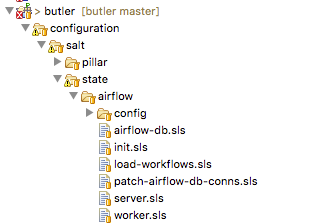

   Airflow state SLS file and folder structure
   
Several related states (such as those describing different installations of the same program) can be grouped together under the same 
parent state. Then each sub-state is placed into its own *.sls* file under the main state's folder, with the name of the file giving 
rise to that state's name. Figure :numref:`airflow_sls` provides an example of this scenario where in addition to the main 
*airflow* state there are sub-states such as *airflow.server*, *airflow.worker*, *airflow.load-workflows* etc. 
Note that sub-states are referenced via *name_of_parent_state.name_of_substate*.

**A Salt Pillar** is a set of key-value pairs that are stored encrypted on a Minion and constitute look-up values that are relevant 
for that Minion's configuration. Examples of Pillar values can be usernames and passwords, locations of certain files, etc. A State 
definition can refer to Pillar values when configuring a system, and two identical VMs that differ only by their Pillar values will 
be parametrized differently at configuration time. One example of this is setting up the same server in a QA environment vs. Production. 
In QA the server may point to a test data directory with especially constructed data files, for testing purposes, whereas in Production 
the server would point to the actual data directory with real samples.

The Pillar are organized similar to States in a folder hierarchy of *.sls* files. :numref:`salt_pillar_hierarchy`

.. _salt_pillar_hierarchy:
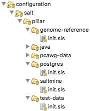

   A set of Salt Pillar definitions


:numref:`salt_pillar_test_data` shows an example Pillar definition where information related to finding test data is stored.

.. _salt_pillar_test_data:
.. code-block:: yaml
	:caption:  Salt Pillar for specifying test data location.

	test_data_sample_path: /shared/data/samples
	
	test_data_base_url: http://ftp.1000genomes.ebi.ac.uk/vol1/ftp/phase3/data/
	
	test_samples:
	  NA12874:
	    -
	      - NA12874.chrom11.ILLUMINA.bwa.CEU.low_coverage.20130415.bam
	      - 88a7a346f0db1d3c14e0a300523d0243
	    -
	      - NA12874.chrom11.ILLUMINA.bwa.CEU.low_coverage.20130415.bam.bai
	      - e61c0668bbaacdea2c66833f9e312bbb


**Salt Grains** are bits of information Salt collects about Minion state or characteristics. They include things like:

* Minion IP address
* Amount of RAM on minions
* Minion hostname
* Minion network interfaces

and others. The Grains can be used to introspect and pass on configuration values (like IP address) that are not known in advance. 
One of the most important uses of Grains is the ability to assign roles to a Minion via the Grains mechanism. Since roles define 
what states are eventually applied, adding or removing a role to a VM via Grains has a very significant side-effect. 

**The Salt Mine** is a centralized repository of information about the state of all Minions that is stored on the Master. 
Information is passed into the Mine from Grains and other sources. It can then be used inside state definitions to further customize 
the system.  

.. _salt_mine:
.. code-block:: text
	:caption:  Using Salt Mine to look up a server's IP Address.

	consul-client:
	  service.running:
	    - enable: True
	    - watch:
	      - file: /etc/opt/consul.d/*    
	
	
	# Create a list of servers that can be used to join the cluster
	
	
	
	
	join-cluster:
	  cmd.run:
	    - name: consul join {{ join_server[0] }}
	    - watch:
	      - service: consul-client

:numref:`salt_mine` demonstrates how the Jinja templating engine is used to look up the IP Address of servers in the cluster 
that have the :code:`consul-server` or:code:`consul-bootstrap` role. Then this IP Address is used inside a State definition to join 
a cluster of similar machines. Without the Mine, this particular Minion would not know who to ask for this IP Address, but because 
the Mine is centralized on the Salt Master host this lookup is possible.

**The Top File** is the mechanism used in Saltstack to specify what VMs will have what States applied to them. The Top File provides 
a lot of flexibility in terms of how to accomplish this mapping. Mappings can be accomplished via hostname or any Grains values, and 
it allows regular expressions. The most flexible and, thus preferred, method of mapping States to VMs is via Roles.

.. _salt_top_file:
.. code-block:: yaml
	:caption:  Using Top File to map States to Roles.
	
	base:
	  '*':
	    - consul
	    - dnsmasq
	    - collectd
	  'G@roles:monitoring-server':
	    - influxdb
	    - grafana 
	  'G@roles:job-queue':
	    - rabbitmq


:numref:`salt_top_file` demonstrates how the State mapping to Roles is accomplished in a Top File. Based on this Top File 
all VMs will get the :code:`consul, dnsmasq, and collectd` states. VMs with the :code:`monitoring-server` role will get 
:code:`influxdb, and grafana`, and VMs with the :code:`job-queue` role will get the :code:`rabbitmq` State.

Controlling Saltstack
.....................

Control over the cluster is exercised from the Salt Master. The user establishes a shell session on the Salt Master and issues 
commands via the Saltstack CLI. Each command has the following syntax:

:code:`"salt target_expression command_expression"` where:

:code:`salt` is the name of the Salt CLI.

:code:`target_expression` is an expression that determines what VMs to apply the command to. It can be a logical expression that 
combines hostnames, grains, and regular expressions.

:code:`command_expression` is an expression that determines what actual command to run on the targeted VMs. 
The :code:`command_expression` can be as simple as running a shell command on the target VMs, or it can apply a particular named 
state via the :code:`state.apply` command, or it can apply all matching states via the special :code:`state.highstate` command.

For example, :code:`salt -G 'roles:worker' state.apply airflow.patch-airflow-db-conns` applies the :code:`airflow.patch-airflow-db-conns` 
state to all VMs that have the :code:`worker` role.

Saltstack Use in Butler
'''''''''''''''''''''''

Butler uses Saltstack extensively in order to install software on the cluster. This includes software that is required to run Butler 
itself, as well as installing scientific algorithms required for running actual workflows on Worker VMs. As seen in Figure 
:numref:`salt_states` the Saltstack configuration in Butler consists of a set of State and Pillar definitions along with the Top 
Files that map these States and Pillar to various VMs in the cluster. These definitions are enough to configure a completely functional 
Butler cluster from a single shell command.

.. _salt_states:
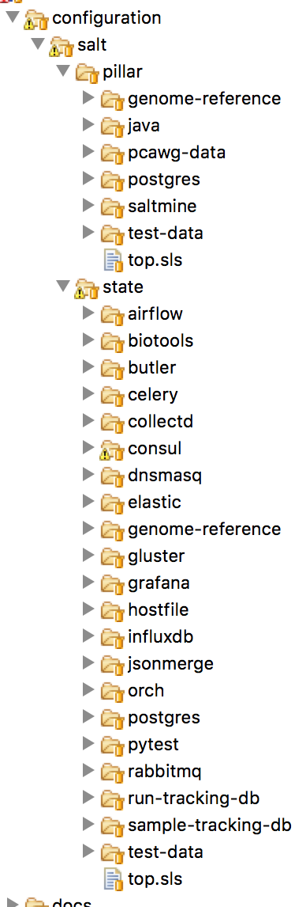

   Salt States and Pillar used in Butler

A typical Butler installation that can support a cluster of up to 1500 CPUs consists of four Control VMs in addition to the Worker VMs, 
each has a separate Terraform profile. The Control VMs are:


* **salt-master** - This machine is the configuration master node. Because this workload is typically only heavy during cluster setup, the same VM also acts as the Monitoring Server during regular operation.
* **db-server** - This VM hosts all the databases that Butler uses.
* **job-queue** - This VM hosts a Queue for distributed task processing.
* **tracker** - This VM hosts all of the workflow engine components, as well as Analysis Tracking.


All of the VMs in the cluster get the following basic configurations mapped in the Top File:

.. code-block:: yaml

	'*':
	  - consul
	  - dnsmasq
	  - collectd
	  - elastic.filebeat
	  - elastic.packetbeat

* **consul** - A framework used for Service Discovery which will be described in detail in Section :numref:`design_consul`
* **dnsmasq** - A local DNS server, to enable name lookups.
* **collectd** - A Metrics collection agent.
* **elastic.filebeat** - A server log harvester.
* **elastic.packetbeat** - A network event log harvester.

Setting up the Salt Master
..........................

The first order of business when setting up a new Butler cluster is to bootstrap the Salt Master VM, as this VM is 
responsible for configuring and installing the software of all the other machines, including itself.

A Butler VM is typically provisioned from a base VM image, which has little more than the barebones OS, using Terraform. 
In the case of the Salt Master, the salt-master daemon is installed via Terraform's :code:`remote-exec` provisioner. 
Salt's :code:`highstate` command is then executed on the master itself in order to fully initialize it. At that point 
the Salt Master is ready to configure other machines that are part of the cluster.

As previously mentioned, because the load on the Salt Master is typically only high during initial cluster setup and 
during short bursts during normal operation, the Salt Master VM typically has another Saltstack Role mapped to it - 
that of the Monitoring Server. This role installs monitoring components that will be described in detail in Section :numref:`monitoring`

Setting up Other Butler Control VMs
...................................

The DB Server VM has a db-server Role mapped to it. Because databases are resource intensive software that does not scale 
horizontally, this VM does not have other roles within the cluster.

.. code-block:: yaml

	'G@roles:db-server':
	  - postgres
	  - run-tracking-db
	  - grafana.createdb
	  - airflow.airflow-db
	  - sample-tracking-db
	  
The Top File mapping of States to the :code:`db-server` role ensures that the PostgreSQL DB Server is installed as well 
as a number of databases that are used by Butler for tracking scientific analyses, workflow statuses, analysis samples, 
and performance metrics.

The Job Queue VM has a :code:`rabbitmq` state mapped to it in the Top File, to install the RabbitMQ queueing system.

The Tracker VM correspondingly has a :code:`tracker` role and the following state mappings:

.. code-block:: yaml

	'G@roles:tracker':
	  - airflow
	  - airflow.load-workflows
	  - airflow.server
	  - jsonmerge
	  - butler

These states install and configure the Airflow Workflow engine, load available workflows, and check out and install the 
Butler codebase from github. The codebase is needed to run the Butler CLI which is used to set up and manage Butler 
analyses. Thus, most interactions the users have with Butler occur from the Tracker VM via the Butler CLI.

Setting up Butler Workers
.........................


While Control VMs will be quite similar from one installation of Butler to the next, the Worker VMs will differ quite a 
bit, depending on what types of analyses are anticipated to be performed. The base Worker VM has the :code:`worker` role 
which simply allows such VMs to run workflows in principle by installing the necessary components of the workflow engine 
and Butler Analysis Tracker.

.. code-block:: yaml

	'G@roles:worker':
	  - dnsmasq.gnos
	  - celery
	  - airflow
	  - airflow.load-workflows
	  - airflow.worker
	  - butler


The actual scientific algorithms that are required for running particular analyses are installed onto Workers via additional 
Roles and States. Because the initial Butler implementation is focused on bioinformatics workflows there already exist 
predefined states for some common bioinformatics tools. An example of such a Role and States can be seen in the Top File 
mapping below:

.. code-block:: yaml

	'G@roles:germline':
	  - biotools.freebayes
	  - biotools.htslib
	  - biotools.samtools
	  - biotools.delly

Customizing Butler Configuration
................................


When Butler is used in different environments, configurations need to change, because of differences in OS, network, and 
underlying analyses. In order to accomplish this, the users will typically need to create their own source code repository 
that will coexist with the base Butler repository. Inside that repository will be custom definitions or workflows, analyses, 
as well as configurations. Where it is possible to configure the system entirely via Pillar, the user should define these 
custom Pillar settings in their repository, but when customizations to the States are required, the user should copy the 
State definition from the base Butler repository into their own and customize as necessary. They should then make sure that 
the customized states are available to Saltstack by downloading them to the Salt Master VM.

When it comes to installing new scientific algorithms for the purposes of running workflows, the users should define any new 
States and Roles as necessary, and then assign them to the Worker VMs prior to calling :code:`highstate` to ensure the software 
get installed properly.


Workflow System
```````````````

Workflow System Overview
''''''''''''''''''''''''

Running scientific workflows at scale is the reason for Butler's existence. Thus, the Workflow Engine lies at the heart of 
the entire system. To fulfill the relevant requirements we have selected the Airflow Workflow Engine developed by Airbnb.
This software is currently in incubation stage as an Apache project. 


Airflow Architecture
....................

The architecture of Airbnb Airflow lends itself well to large-scale distributed processing of tasks, due to the loosely 
coupled nature of the system. The key component at the heart of Airflow is the Airflow Scheduler. The airflow-scheduler 
is a service that runs perpetually on a VM and examines the state of all running workflows. All workflow tasks that meet the 
preconditions for being runnable are immediately "scheduled" for execution. In the context of Airflow scheduling means depositing 
the task into a queue (running on a separate Queue Server VM) from which a Worker VM can eventually pick it up. The Worker VMs run 
an airflow-worker service which periodically polls the task queue for available tasks and when the task is runnable by a particular 
Worker, that Worker consumes the task message from the queue and assumes execution. In order to keep track of the status of Workers 
and workflow execution each Worker periodically sends heartbeat messages to the Scheduler to communicate state. The state is 
persisted by the Scheduler to a PostgreSQL database which runs on a DB Server VM.

Additional state information related to tracking scientific analyses is written to a separate PostgreSQL database which runs 
on the same DB Server.

The user can communicate with and commandeer Airflow via the Airflow CLI, as well as a Web UI. The Web UI is provided via the 
*airflow-flower*, and *airflow-webserver* services which can run on the same VM as the Scheduler or on a separate VM, depending 
on system load.
 
Workflow Definition
'''''''''''''''''''

Conceptually, an Airflow workflow is a Directed Acyclic Graph whose vertices represent tasks and edges indicate task sequence. 
In its implementation an Airflow workflow is a Python program that can use any Python language construct or library. This allows 
the users to create workflows of arbitrary complexity and functionality.

When authoring workflows the user needs to create an instance of the :python:`DAG` class.

.. code-block:: python
	
	class airflow.models.DAG(dag_id, schedule_interval=datetime.timedelta(1), start_date=None, end_date=None, full_filepath=None, template_searchpath=None, user_defined_macros=None, default_args=None, concurrency=16, max_active_runs=16, dagrun_timeout=None, sla_miss_callback=None, params=None)


The key parameters to the :python:`DAG` constructor are:


* **dag_id** - Unique identifier for the workflow.
* **schedule_interval** - How often the workflow is executed.
* **default_args** - A dictionary of arguments that is passed to tasks within this workflow.
* **concurrency** - Maximum number of concurrent workflow tasks.
* **max_active_runs** - Maximum number of simultaneously active workflow runs.


Once the :python:`DAG` is created the user can define workflow tasks. Each task is encoded as a subclass of Operator. 
There are three main types of Operator in Airflow:

* Operators that represent actions that need to be taken.
* Transfer operators which represent movement of data.
* Sensor operators which poll the environment for a specified condition.


All Operators are derived from the :python:`BaseOperator` class.

.. code-block:: python

	class airflow.models.BaseOperator(task_id, owner='airflow', email=None, email_on_retry=True, email_on_failure=True, retries=0, retry_delay=datetime.timedelta(0, 300), retry_exponential_backoff=False, max_retry_delay=None, start_date=None, end_date=None, schedule_interval=None, depends_on_past=False, wait_for_downstream=False, dag=None, params=None, default_args=None, adhoc=False, priority_weight=1, queue='default', pool=None, sla=None, execution_timeout=None, on_failure_callback=None, on_success_callback=None, on_retry_callback=None, trigger_rule=u'all_success', resources=None, *args, **kwargs)


An Operator can take many parameters, the most important ones are:


* **dag** - Reference to the DAG this task belongs to.
* **task_id** - Unique identifier for the task.
* **retries** - Along with several other parameters, this controls retry behaviour in case of failures.
* **priority_weight** - Relative importance of scheduling this task compared to other tasks.
* **trigger_rule** - Condition under which this task triggers. One of - all_success | all_failed | one_success | one_failed. This condition evaluates the state of tasks that are upstream of this one.


A large number of Operator implementations are available that simplify the creation of arbitrary workflows. Some of these are:

* **BashOperator** - Execute a shell script.
* **PythonOperator** - Execute a Python callable.
* **EmailOperator** - Send an email.
* **ExternalTaskSensor** - Wait for a task in a different workflow to complete.
* **HdfsSensor** - Wait for a file to appear in HDFS.
* **HiveOperator** - Execute a Hive query.
* **SimpleHttpOperator** - Make a call to an HTTP endpoint.
* **PostgresOperator** - Execute a PostgreSQL query.
* **DockerOperator** - Execute a command inside a Docker container.
* **SSHExecuteOperator** - Execute commands on a remote host.


In practice we find that the :python:`PythonOperator` is the most versatile as it provides the ability to call arbitrary Python 
code which can, in turn, accomplish any of the tasks of the other operators if necessary.

Once tasks are defined their dependencies can be established by calling :python:`task_2.set_upstream(task_1)` or 
:python:`task_1.set_downstream(task_1)`. The :python:`set_upstream()` and :python:`set_downstream()` methods also 
accept lists of tasks for bulk assignment.

When a workflow is executed each task definition is transformed into a task instance - a task that is running at 
some point in time. Although the entire workflow may be defined in the same source file, Airflow makes no guarantees 
about where each task instance will run. Once a task instance is placed into the task queue technically any worker 
can pick up and execute that task. On the one hand this provides a limitation because it makes it difficult for 
tasks to exchange information between each other (due to possible remoteness), on the other hand, this model 
promotes scalability as it limits dependencies between tasks and simplifies scheduling.

Because no assumptions are made about which worker will run which tasks, each worker needs to have a copy of all 
workflow definitions that are active in the system. Furthermore, any programs that may be invoked inside a task 
also need to be installed on the workers. Unfortunately, Airflow does not provide any mechanisms for declaring and 
checking whether the programs a workflow depends on are installed and available prior to task instance runtime. 
This means that most bugs and issues related to dependency installation are only discovered when an actual workflow 
is running and fails. Thankfully, the job of installing and configuring dependencies is made relatively easy by the 
Butler Configuration Management System. 

.. _analysis_tracker_section:

Analysis Tracker
''''''''''''''''

A System of Record is necessary to track the scientific analyses that are undertaken using the Butler system. 
To fulfill these requirements we have built an Analysis Tracker module into Butler. The goal of this module is to allow the user 
to define analyses, specify what workflows are part of these analyses, and track the status and execution of Analysis Runs - 
instances of running a particular workflow on a particular data sample within the context of an Analysis. To accomplish this 
we have established a Run Tracking Database on PostgreSQL to persist the data, we have built a tracker Python module that 
implements the management of these objects, and finally, we have built a set of standard workflow tasks that the users can 
insert into their workflows in order to report progress to the Analysis Tracker.

tracker Python Module
.....................

The layout of the tracker module can be seen in :numref:`tracker_module_files` below:

.. _tracker_module_files:
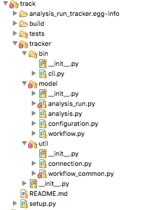

   File hierarchy of the tracker module.

At the root of the hierarchy are the README file and the module installation script :shell:`setup.py`. Inside the :shell:`bin` 
directory is the Analysis Tracker CLI implementation - :shell:`cli.py`. Inside the :shell:`model` directory lies the 
implementation of the main model objects - Workflow, Analysis, Analysis Run, and Configuration. We describe the first 
three of these objects in detail in this section and the last one in :numref:`workflow_configuration_design`. 
Inside the :shell:`util` directory are utility functions -  :shell:`connection.py` for connecting to the Run Tracking Database, 
and :shell:`workflow_common.py` for implementations of common workflow tasks.

The overall model can be seen in :numref:`analysis_tracker_model`

.. _analysis_tracker_model:
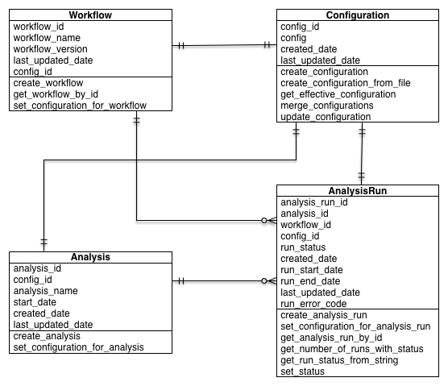

   UML model of the Analysis Tracker.

**The Workflow** object represents a workflow definition. Every workflow managed by Butler should have a corresponding 
Workflow object representing it. It has the following fields:

* **workflow_id (UUID)** - This is the unique identifier of this workflow.
* **workflow_name (String)** - This is a human-friendly name for the workflow.
* **workflow_version (String)** - It is important to record what version of a workflow is being used, as updates are frequently made during the workflow lifecycle.
* **last_updated_date (datetime)** - Timestamp of last update to this object.
* **config_id (UUID)** - The unique identifier of the corresponding Configuration object.


The Workflow object implements the following methods:

* :python:`create_workflow(workflow_name, workflow_version, config_id)` - Create a new workflow object with given name, version, and configuration.
* :python:`get_workflow_by_id(workflow_id)` - Retrieve the workflow with ID :python:`workflow_id` from persistent storage.
* :python:`set_configuration_for_workflow(workflow_id, config_id)` - Update the workflow configuration to configuration with ID :python:`config_id`.

**The Analysis** object represents a scientific analysis. It serves the purpose of aggregating the running of a set of 
workflows on a set of data samples together into a single unit of execution that can be referred to for organization 
purposes. The Analysis has the following fields.

* **analysis_id (UUID)** - This is the unique identifier of this Analysis.
* **analysis_name (String)** - This is a human-friendly name for the Analysis.
* **start_date (datetime)** - Date of when the Analysis is meant to start.
* **created_date (datetime)** - Date of when the Analysis was created.
* **last_updated_date (datetime)** - Timestamp of last update to this object.
* **config_id (UUID)** - The unique identifier of the corresponding Configuration object.

The Analysis object has the following methods:

* :python:`create_analysis(analysis_name, start_date, config_id)` - Create a new Analysis object with given name, :python:`start_date`, and configuration.
* :python:`set_configuration_for_analysis(analysis_id, config_id)` - Update the Analysis configuration to configuration with ID :python:`config_id`.

**The AnalysisRun** object represents the invocation of a particular Workflow on a particular Data Sample, within 
the scope of a particular Analysis. This object is central to the Analysis Tracking functionality. The AnalysisRun 
object has the following fields:


* **analysis_run_id (UUID)** - This is the unique identifier of this Analysis Run.
* **analysis_id (UUID)** - This is the unique identifier of the Analysis for this Analysis Run.
* **workflow_id (UUID)** - This is the unique identifier of the Workflow for this Analysis Run.
* **run_status (int)** - This integer field indicates the status of this Analysis Run. Status can be one of :python:`RUN_STATUS_READY, RUN_STATUS_SCHEDULED, RUN_STATUS_IN_PROGRESS, RUN_STATUS_COMPLETED, RUN_STATUS_ERROR`.
* **created_date (datetime)** - Date of when the Analysis Run was created.
* **run_start_date (datetime)** - Date of when the Analysis Run started.
* **run_end_date (datetime)** - Date of when the Analysis Run ended.
* **last_updated_date (datetime)** - Timestamp of last update to this object.
* **run_error_code (int)** - Integer pointing to an error code of Runs that ended in error.
* **config_id (UUID)** - The unique identifier of the corresponding Configuration object.

The Analysis Run object implements the following methods:

* :python:`get_run_status_from_string(run_status_string)` - Translate string-based run statuses into int-based ones.
* :python:`create_analysis_run(analysis_id, config_id, workflow_id)` - Create an AnalysisRun and store in the database.
* :python:`set_configuration_for_analysis_run(analysis_run_id, config_id)` - Update the AnalysisRun configuration to configuration with ID :python:`config_id`.
* :python:`get_analysis_run_by_id(analysis_run_id)` - Get the Analysis Run with ID :python:`analysis_run_id`.
* :python:`set_ready(my_run)` - Set the status of a given analysis run to :python:`RUN_STATUS_READY`. Only possible if the current status is not :python:`RUN_STATUS_IN_PROGRESS`.
* :python:`set_scheduled(my_run)` - Set the status of a given analysis run to :python:`RUN_STATUS_SCHEDULED`. Only possible if the current status is :python:`RUN_STATUS_READY`.
* :python:`set_in_progress(my_run)` - Set the status of a given analysis run to :python:`RUN_STATUS_IN_PROGRESS`. Only possible if the current status is :python:`RUN_STATUS_SCHEDULED`.
* :python:`set_completed(my_run)` - Set the status of a given analysis run to :python:`RUN_STATUS_COMPLETED`. Only possible if the current status is :python:`RUN_STATUS_IN_PROGRESS`.
* :python:`set_error(my_run)` - Set the status of a given analysis run to :python:`RUN_STATUS_ERROR`.
* :python:`get_number_of_runs_with_status(analysis_id, run_status)` - Returns the number of AnalysisRuns of a given status.

As can be seen from the description of the methods of :python:`AnalysisRun` these objects follow a particular
 lifecycle that is represented by their :python:`status` attribute. The rules that govern allowable status 
 transitions are encoded within the series of :python:`set_*` methods and are summarized in :numref:`analysis_run_status_transitions`

.. _analysis_run_status_transitions:
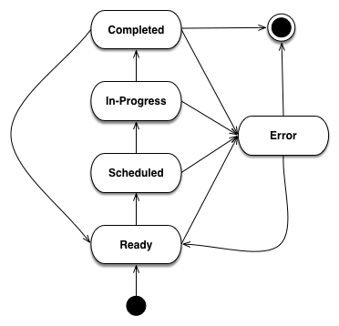

   State Diagram of Analysis Run Status Transitions.

When an :python:`AnalysisRun` is first created it does not have a status. Once the object is fully initialized 
it is given a Ready status, indicating that it is ready to be scheduled for execution. Once the Scheduler has 
scheduled the Run for execution it is given a Scheduled status. When workflow execution starts the Run is marked 
In-Progress. Once the Run is successfully completed it enters a Completed status. If, at any point, the Run encounters 
an error condition it cannot recover from, the Run Status is set to Error. When the error condition is addressed the 
Run status should be set to Ready so that it can start from the beginning.

**The workflow_common.py** file within the tracker module contains a number of convenience functions that workflows 
can use to perform common tasks. Currently the following functions are supported:

* :python:`get_config(kwargs)` - Get the Configuration supplied to this Workflow.
* :python:`get_sample(kwargs)` - Get the sample assigned to this Workflow.
* :python:`start_analysis_run(**kwargs)` - Mark the Analysis Run of this Workflow In-Progress.
* :python:`complete_analysis_run(**kwargs)` - Mark the Analysis Run of this Workflow Complete. 
* :python:`set_error_analysis_run(**kwargs)` - Mark the Analysis Run of this Workflow as Error.
* :python:`validate_sample(**kwargs)` - Test whether the sample files are accessible to the workflow.
* :python:`call_command(command, command_name, cwd=None)` - Wrapper around Python's :python:`subprocess.call` method that captures logging information.
* :python:`compress_sample(result_filename, config)` - Compress the sample with gzip.
* :python:`uncompress_gzip_sample(result_filename, config)` - Uncompress the sample.

Every workflow should begin by starting the corresponding Analysis Run, and finish by completing it to ensure 
appropriate tracking of information throughout the system.

**The connection.py** file is also a key component of the tracker module because it provides a means to 
communicate with the Run Tracking Database.

The Run Tracking Database is a PostgreSQL database this is set up to persist all of the Analysis related 
information into permanent storage in order to fulfill the System of Record requirements. Specifically, 
the Run Tracking Database contains a relational model that corresponds to the Python objects described 
above. These tables are as follows:

.. csv-table:: Workflow DB table
	:header: "Column Name", "Type", "Constraint"
	
	"workflow_id", "serial", "PRIMARY KEY"
	"config_id", "uuid", "REFERENCES configuration(config_id)"
	"workflow_name", "varchar(255)"  
	"workflow_version", "varchar(255)"
	"created_date", "timestamp"
	"last_updated_date", "timestamp"
	
|

.. csv-table:: Analysis DB table
	:header: "Column Name", "Type", "Constraint"

	"analysis_id", "serial", "PRIMARY KEY"
	"config_id", "uuid", "REFERENCES configuration(config_id)"
	"analysis_name", "varchar(255)"
	"start_date", "timestamp"
	"created_date", "timestamp"
	"last_updated_date", "timestamp"
	
|

.. csv-table:: Analysis DB table
	:header: "Column Name", "Type", "Constraint"

	"analysis_run_id", "serial", "PRIMARY KEY"
	"analysis_id", "serial", "REFERENCES analysis(analysis_id)"
	"workflow_id", "serial", "REFERENCES workflow(workflow_id)"
	"config_id", "uuid", "REFERENCES configuration(config_id)"
	"run_status", "integer", "NOT NULL"
	"created_date", "timestamp"
	"run_start_date", "timestamp"
	"run_end_date", "timestamp"
	"last_updated_date",  timestamp"
	"run_error_code", "integer"
	
|

In order to maintain a mapping between the Python objects in the tracker module and the tables in the 
Run Tracking Database as well as to avoid getting tied to a particular SQL dialect we utilize the SQL 
Alchemy Object Relational Framework. This framework allows us to avoid an explicit mapping between 
table columns, and object fields. Instead, SQL Alchemy is able to introspect the relational schema and 
add the object fields as necessary that correspond to the columns. Furthermore, updates to the Python 
objects are automatically translated to SQL :sql:`UPDATE` statements and executed as necessary. This 
framework allows us to change to a different SQL Engine if necessary, without having to change most 
of the code.

Workflow Configuration
''''''''''''''''''''''

In order to fulfill its workflow configuration and parametrization requirements Butler implements a 
tri-level configuration mechanism, allowing the user to specify configurations at Workflow, Analysis, 
and Analysis Run levels. At runtime all three configuration levels are merged into one *effective* 
configuration that applies within the execution context.

.. _effective_configuration:
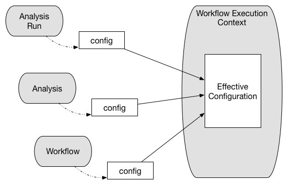

   Tri-level configuration combines into an effective configuration at runtime.

The configuration facility is built into the :python:`tracker` module, and is backed by a Run Tracking 
Database configuration table for persistence.

Because it is important for configuration to be both human-readable and machine-readable Butler uses 
the JSON format to encode configuration information. PostgreSQL, in turn, has native support for storage 
and deep querying of JSON values, thus making it an ideal choice for configuration persistence.

Configuration Mechanism
.......................

The mechanism by which configuration works is as follows:

A workflow author provides, together with their workflow definition, a JSON file that contains the most 
coarse-grained configurations related to the workflow. A system operator may customize some of these values 
before adding the workflow to a deployed version of Butler. Once the workflow is added to the system its 
accompanying configuration is persisted to the database.

A user who is running an analysis defines an analysis-level JSON file with more fine-grained configuration 
values. Algorithm parameters and flags are typical such values that vary from one analysis to the next. 
These are also persisted to the database along with the analysis definition.

As the analysis run corresponds to running a particular workflow in the context of a particular analysis 
on a particular sample, the user needs to generate a separate JSON configuration file for each sample in 
the analysis. These files will contain the most fine-grained configurations. Typical values at this level 
indicate where to locate the particular sample file for this run, and where to store the run results. An 
effective way to generate many JSON files for these runs is via a script.

When a workflow is executed on a particular sample, the JSON files corresponding to all three levels of 
configuration are retrieved from the database, merged, and parsed into a Python dictionary. This dictionary 
is then made available within the workflow execution context to guide workflow decision logic.

Workflow Runtime Management
'''''''''''''''''''''''''''

Workflow Runtime Management encompasses the tools that are available to the user for the purpose of managing 
workflow execution. In Butler there are three separate mechanisms that exist for this purpose. These are:

* Butler CLI
* Airflow CLI
* Airflow Web UI

Butler CLI
..........

The Butler CLI allows the user to create the various analysis management objects described in 
Section :numref:`analysis_tracker` via a Command Line Interface. The following commands are supported:

:shell:`create-workflow` - creates a new workflow and supports the following parameters:

* **-n, --workflow_name** - The name of the workflow.
* **-v, --workfow_version** - The version of the workflow.
* **-c, --config_file_location** - Path to the workflow configuration JSON file.


**:shell:`create-analysis`** - creates a new analysis and supports the following parameters:

* **-n, --analysis_name** - The name of the analysis.
* **-d, --analysis_start_date** - The starting date of the analysis.
* **-c, --config_file_location** - Path to the analysis configuration JSON file.


:shell:`launch-workflow` - launches workflow execution and supports the following parameters:

* **-w, --workflow_id** - ID of the workflow to launch.
* **-a, --analysis_id** - ID of the analysis to launch the workflow under.
* **-c, --config_location** - Path to a directory that contains analysis run configuration JSON files that will be launched. 

:shell:`update-config` - Update the configuration for a workflow or analysis.

* **-w, --workflow_id** - ID of the workflow to update.
* **-a, --analysis_id** - ID of the analysis to update.
* **-c, --config_file_location** - Path to the new config file.


:shell:`get-run-count` - Print to stdout the number of analysis runs for a particular analysis.

* **-a, --analysis_id** - ID of the analysis to look up.
* **-s, --run_status** - Restrict the lookup to runs with a particular status

Airflow CLI
...........

The Airflow CLI is part of the generic Airflow framework and provides a number of commands for workflow 
management. We describe several of the most useful ones below:

:shell:`airflow` - The main Airflow CLI command, with these supported sub-commands:

* **webserver** - Start an instance of the Airflow Web UI.
* **scheduler** - Start an instance of the Airflow Scheduler.
* **worker** - Start an instance of the Airflow Worker.
* **flower** - Start an instance of the Airflow Flower, which is a monitoring tool.
* **clear** - Clear the state of tasks that have failed or are stuck to allow them to be scheduled again.
* **task_state** - Print out the state of a task.
* **initdb** - Initialize an empty Airflow database.
* **resetdb** - Reset an Airflow database to the empty state.
* **list_dags** - List all of the available workflows.
* **list_tasks** - List all of the tasks for a particular workflow.

Butler provides wrappers for the :shell:`webserver, scheduler, worker, and flower` commands so that they 
can be run as system services.

Airflow Web UI
..............

The Airflow Web UI provides an interactive dashboard that allows the user to monitor the progress of 
workflows and workflow tasks, as well as taking some remedial actions when tasks run into trouble.

.. _airflow_web_ui_main_page:
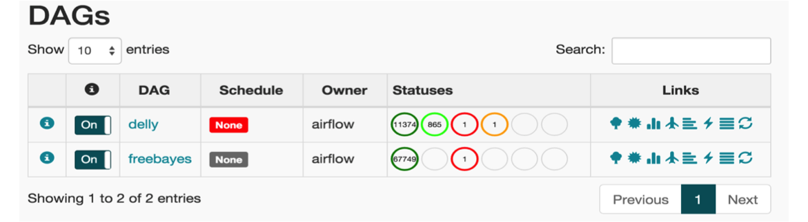

   The main page of the Airflow Web UI.

The main page of the Web UI features a listing of the available workflows, along with the breakdown 
of workflow tasks by status. In :numref:`airflow_web_ui_main_page` we see two workflows - freebayes 
and delly. The delly workflow has 11374 completed tasks, 865 in-progress tasks, 1 failed task, and 1 
task with a failed ancestor. The user can click on any of the task statuses to navigate to a task listing 
page that gives a comprehensive list of tasks along with their key attributes (see :numref:`airflow_task_instances`).

.. _airflow_task_instances:
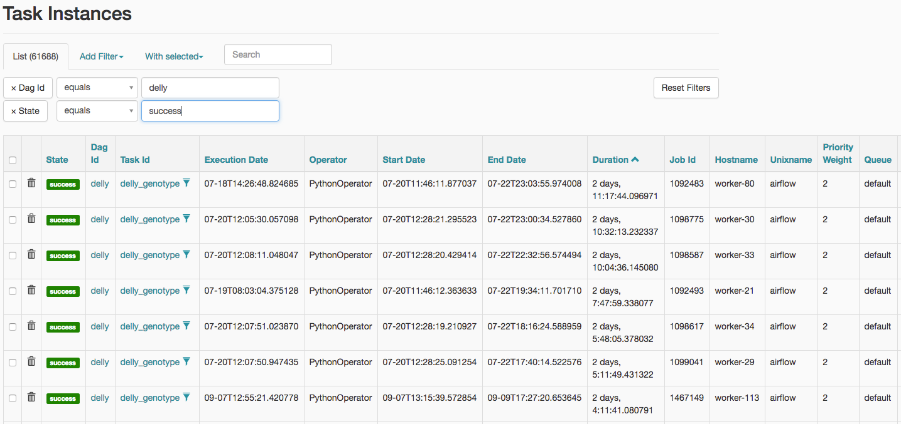

   Listing of task instances for the freebayes workflow with status of "success".

Clicking on one of the task instances will bring up a graphical view of the workflow the task belongs 
to and allow the user to further investigate that workflow's execution (see :numref:`airflow_workflow_details`). 
This view shows the status of all tasks in the corresponding workflow instance as well as providing 
links to various reports.

.. _airflow_workflow_details:
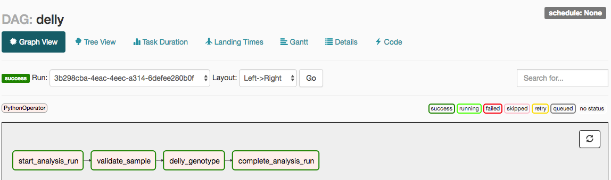

   Details of the execution of a delly workflow with ID 3b298cba-4eac-4eec-a314-6defee280b0f.
   
When the user clicks on a particular task instance within the workflow execution a popup window allows 
them to take a number of actions, such as forcing the task to be run immediately, clearing the task 
state (for failed tasks) so that it can be run again, or marking the task as successfully completed 
(possibly with all upstream and downstream tasks). These options are depicted in 
:numref:`airflow_task_actions`.

.. _airflow_task_actions:
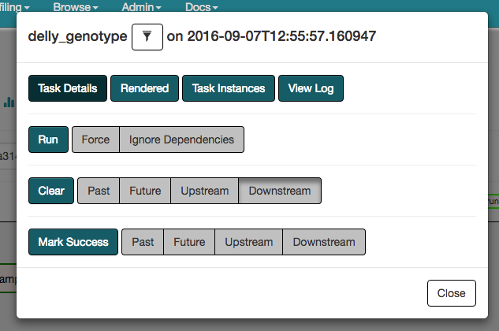

   A list of actions that can be taken on a workflow task via the Web UI.

